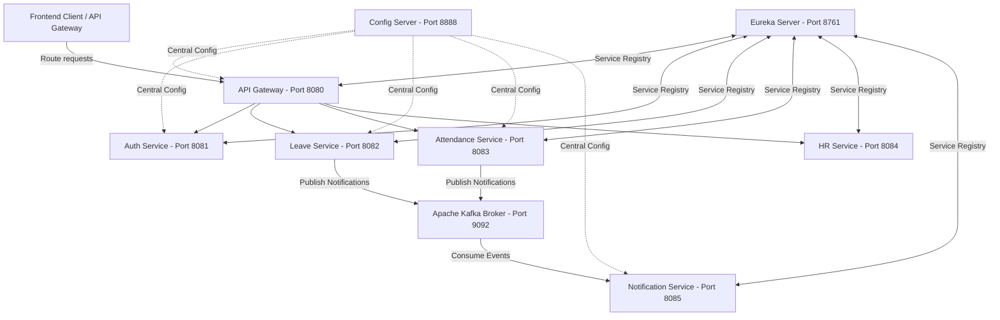

# TechNova HRMS Backend Microservices

Welcome to the backend architecture of **TechNova HRMS** (Human Resource Management System). This project is designed as an enterprise-grade, event-driven microservices architecture built on top of **Spring Boot 3.x / 4.x**, **Spring Cloud**, **Apache Kafka**, and **MySQL**.

---

## 1. System Architecture Diagram

---

## 2. Infrastructure Services (Why they exist & Design rationale)

### A. Config Server (`config-server` - Port 8888)
* **Purpose:** Acts as the centralized configuration repository. 
* **Why it exists:** In a microservices architecture, managing `application.properties`/`application.yml` files individually inside each jar becomes a nightmare. If we change database credentials or Kafka hosts, we would have to rebuild all services. Config Server pulls configurations from the local `config-repo` directory and serves them dynamically to all active microservices.
* **Key Configuration:** Connected to `config-repo/application.yml` for unified profiles.

### B. Eureka Discovery Server (`eureka-server` - Port 8761)
* **Purpose:** Serves as a dynamic service registry.
* **Why it exists:** Microservices run on dynamic IP addresses and ports (especially when scaled). Eureka allows services to register themselves on startup. Instead of hardcoding URLs (e.g., `http://localhost:8081`), services look up other services by their registry name (e.g., `AUTH-SERVICE`) via Eureka.

### C. API Gateway (`api-gateway` - Port 8080)
* **Purpose:** Single entry point for all frontend requests.
* **Why it exists:** The frontend should not need to keep track of 5 different backend URLs. The gateway handles routing, load balancing, and header propagation.
* **Routing Table:**
  * `/api/auth/**` -> `AUTH-SERVICE`
  * `/api/leaves/**` -> `LEAVE-SERVICE`
  * `/api/attendance/**` -> `ATTENDANCE-SERVICE`
  * `/api/hr/**` -> `HR-SERVICE`

---

## 3. Core Business Services

### A. Auth Service (`auth-service` - Port 8081)
* **Purpose:** User registration, authorization, JWT generation, and admin approvals.
* **Why it exists:** Handles core security. Users registration starts as `approved = false` (Pending Approval).
* **Role Approvals:** Only users with `ADMIN` privileges can approve pending registrations. Once approved, the user gets permission to authenticate and access the gateway.
* **Recent Bug Fix:** The `UserResponse` DTO was updated to serialize the `approved` field so that the frontend admin dashboard doesn't re-display already-approved users in the pending requests queue.

### B. Leave Service (`leave-service` - Port 8082)
* **Purpose:** Handles leave balances, application, cancellations, and approvals.
* **Business Logic Rules:**
  * **Insufficient Balance Check:** Prevents employees from applying if their balance runs out.
  * **Medical Certificate:** If `MEDICAL` leave duration exceeds 3 contiguous business days, a Base64-encoded PDF/Image certificate must be attached (Anti-Loophole mechanism).
  * **10+ Days Escalation (Updated):** Any type of leave request equal to or exceeding 10 days (`duration >= 10`) requires dual approval: first by the Manager (sets status to `PENDING_HR`) and then by HR (sets status to `APPROVED`).
* **Event-Driven Integration:** Publishes `NotificationEvent` messages to the Kafka `notification-topic` on state changes.

### C. Attendance Service (`attendance-service` - Port 8083)
* **Purpose:** Daily check-ins, check-outs, and work hour tracking.
* **Event-Driven Integration:** Generates check-in notifications via Kafka.

### D. HR Service (`hr-service` - Port 8084)
* **Purpose:** Organization-wide reporting, analytics, and cross-team attendance monitoring.

### E. Notification Service (`notification-service` - Port 8085)
* **Purpose:** Listens to Kafka messages and processes notification dispatches (e.g., sending emails or alerts).
* **Kafka Deserializer Fix (Updated):** The programmatic consumer factory in `KafkaConfig.java` has been upgraded to:
  1. Use `JacksonJsonDeserializer` (solving the Spring Kafka 4.x deprecation of `JsonDeserializer`).
  2. Call `setUseTypeHeaders(false)` so that type mismatch issues (e.g. `ClassNotFoundException` due to package naming differences between producers and consumers) are skipped, and all payloads are directly deserialized into the local `NotificationRequest` schema.
  3. Wrapped inside `ErrorHandlingDeserializer` to trap poisoned messages and prevent infinite retry/crash loops.

---

## 4. Run / Setup Instructions

### Prerequisites
1. **Java Development Kit (JDK) 21** or higher.
2. **Apache Kafka** broker running on `localhost:9092`.
3. **MySQL Server** running with database schemas created.

### Execution Order
Run the services in this exact order to prevent dependency failures:
1. **Config Server** (`config-server`)
2. **Eureka Server** (`eureka-server`)
3. **Kafka Broker** (make sure Apache Kafka is active on port 9092)
4. **Auth Service** (`auth-service`)
5. **Leave Service** (`leave-service`)
6. **Attendance Service** (`attendance-service`)
7. **HR Service** (`hr-service`)
8. **Notification Service** (`notification-service`)
9. **API Gateway** (`api-gateway`)
