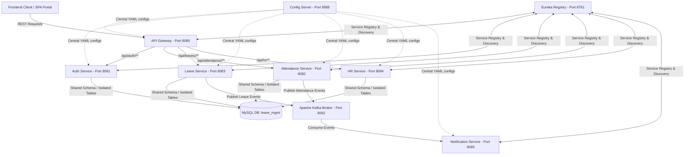

# TechNova HRMS Backend Microservices: Architecture & Workflow Guide

Welcome to the backend architecture documentation of **TechNova HRMS** (Human Resource Management System). This project is designed as an enterprise-grade, event-driven microservices architecture built on top of **Spring Boot 3.x/4.x**, **Spring Cloud**, **Apache Kafka**, and **MySQL**.

This document explains **why** the system is built this way, **how** the services communicate, and the **end-to-end business workflows** that keep the organization running.

---

## 1. System Architecture Diagram



---

## 2. Core Architectural Patterns (The "Why" and "How")

### A. Shared Database Schema with Table Isolation
* **Why:** In traditional microservices, each service has its own database. However, for a tightly coupled domain like HRMS, setting up complex distributed transactions or Feign Client queries between `auth-service` and `leave-service` for simple user lookups adds heavy network latency and complexity.
* **How:** All microservices connect to a single MySQL database schema (`leave_mgmt`). However, each microservice manages and is responsible for its own set of tables (e.g., `auth-service` owns `users`, `leave-service` owns `leave_requests` and `leave_balances`, `attendance-service` owns `attendance`). To query cross-domain data (e.g., fetching a manager's assigned HR name inside `leave-service`), services utilize lightweight, highly optimized read-only native SQL queries via `JdbcTemplate` instead of slow API calls.

### B. Stateless JWT Authentication & Gateway Header Propagation
* **Why:** To make the microservices horizontally scalable, the backend must be completely stateless. Sessions should not be stored in server memory.
* **How:** 
  1. The user logs in via `auth-service` and receives a stateless JSON Web Token (JWT) containing their credentials, role, assigned HR ID, and KYC status.
  2. For subsequent requests, the frontend sends this token in the `Authorization` header.
  3. The `api-gateway` intercepts the request, validates the token signature, and extracts user details.
  4. The gateway wraps the request and injects user claims as headers (`X-User-Id`, `X-User-Role`, `X-User-Name`, etc.) before forwarding the request to downstream services. Downstream microservices trust these headers, making them lightweight and free of security validation boilerplate.

### C. Event-Driven Notifications via Kafka
* **Why:** Sending email notifications or logging audits during a HTTP request slows down response times. If the mail server is down, the whole leave application fails.
* **How:** When a leave is applied, approved, or a check-in occurs, the corresponding microservice publishes an event to Apache Kafka. The `notification-service` listens to these topics asynchronously and processes the dispatch without blocking the main user request.

---

## 3. Deep-Dive: Infrastructure Services

### A. Config Server (`config-server` - Port 8888)
* **Why:** Centralizes configuration properties. If the MySQL password or Kafka server host changes, we update one central file in `config-repo` rather than rebuilding and redeploying 6 separate microservices.
* **How:** Dynamically fetches configuration configurations from `config-repo/` and serves them to bootstrap each service on startup.

### B. Eureka Discovery Server (`eureka-server` - Port 8761)
* **Why:** Services run on dynamic IPs/ports. Hardcoding URLs causes failures when scaling.
* **How:** Each microservice registers its availability on startup. The API Gateway and other services look up targets dynamically using logical service IDs (e.g. `lb://leave-service`) via Eureka.

### C. API Gateway (`api-gateway` - Port 8080)
* **Why:** Prevents exposing internal ports directly, handles CORS, and intercepts requests for security verification.
* **How:** Handles routing rules, filters requests through a JWT authentication filter, extracts user claims, and injects them into downstream headers.

---

## 4. Deep-Dive: Core Business Services

### A. Auth Service (`auth-service` - Port 8081)
* **Responsibilities:** User Registration, Login, KYC Approval, and User Hierarchy Mapping.
* **Why:** Serves as the identity provider. When users register, they are initially flagged as `approved = false` and `kycStatus = PENDING`.

### B. Leave Service (`leave-service` - Port 8083)
* **Responsibilities:** Leave Balances (Casual, Medical, Paid), Applications, Approvals, and Multi-tier Escalation.
* **Why:** Enforces organizational policies (e.g., ensuring employees don't take leaves beyond their balance, enforcing medical certificate uploads for leaves exceeding 3 days, and routing approvals).

### C. Attendance Service (`attendance-service` - Port 8082)
* **Responsibilities:** Check-In/Check-Out logging, work duration calculation, and late arrival auditing.
* **Why:** Monitors shift compliance. Automatically flags check-ins after 09:15 AM as `late = true`.

### D. HR Service (`hr-service` - Port 8084)
* **Responsibilities:** Cross-company attendance monitoring and high-level dashboard metrics.

### E. Notification Service (`notification-service` - Port 8085)
* **Responsibilities:** Asynchronous email and alert distribution.
* **Advanced Deserialization Strategy:** Upgraded using Spring's `ErrorHandlingDeserializer` combined with `JacksonJsonDeserializer` and `setUseTypeHeaders(false)`. This bypasses strict Java package class mappings, allowing different microservices to publish generic JSON payloads to Kafka without class-cast exceptions, and protects the system against poisoned message lockups.

---

## 5. End-to-End Business Workflows

### 📋 Workflow 1: Employee Registration & KYC Approval
```
[Employee signs up] -> (User Created: approved=false, kycStatus=PENDING)
                            ↓
                    [Employee uploads KYC Documents]
                            ↓
                    [Manager views KYC Dashboard]
                            ↓
                    [Manager Approves/Rejects KYC]
                            ↓
[If Approved: approved=true, kycStatus=APPROVED -> Employee can now login & mark attendance]
```

### 🔗 Workflow 2: Hierarchical Assignment (Admin & HR Routing)
1. **Admin creates Manager/HR**: When creating a user with the `MANAGER` role, the Admin selects their assigned **HR Coordinator** (persisted as `hr_id` on the manager's profile).
2. **HR assigns Manager to Employee**: On the HR dashboard, the HR Coordinator maps employees to their respective **Reporting Managers** (persisted as `manager_id` on the employee's profile).
3. **Outcome:** A robust 3-tier hierarchy is established in the database:
   $$\text{Employee} \xrightarrow{\text{reports to}} \text{Manager} \xrightarrow{\text{reports to}} \text{Assigned HR}$$

### ✈️ Workflow 3: Leave Application & Smart Routing
```
[Employee fills Leave Form] 
       ↓
(Frontend sends request with managerId = 0. No manual selector needed!)
       ↓
[Leave Service intercepts request]
       ↓
[Service runs query: SELECT manager_id FROM users WHERE id = EmployeeId]
       ↓
(Stamps Employee's assigned manager ID onto the LeaveRequest. Status: PENDING_MANAGER)
       ↓
[Only the assigned Manager sees the request under "Pending Approvals"]
```

### ⚡ Workflow 4: Escalation & Dual Approvals (> 10 Days Rule)
For leaves longer than 10 business days (11+ days), a single manager approval is not enough:
```
[Employee requests 12 days of leave] -> (Status: PENDING_MANAGER)
                                             ↓
                                    [Manager Approves]
                                             ↓
                             (Is duration > 10 days? YES)
                                             ↓
                      [Leave status escalates to PENDING_HR]
                      [Service maps request's hrId to Manager's assigned HR]
                                             ↓
                            [Only assigned HR sees and approves]
                                             ↓
                   [Status becomes APPROVED -> Balance Deducted]
```
*Note: If the leave is $\le 10$ days, the manager's approval immediately sets the status to `APPROVED` and deducts the balance.*

### 🔍 Workflow 5: Manager's Employee Details Dialog
Inside the **My Team** section, managers can inspect team details.
* **Independent Data Loading:** To make the UI fast and resilient, clicking an employee triggers three independent, parallel asynchronous promises (`Promise.all`):
  1. `getUserBalance(userId)` -> Displays Casual, Medical, and Paid balances.
  2. `getUserLeaves(userId)` -> Displays all applied leaves and their status.
  3. `getUserAttendanceBetween(userId, start, end)` -> Displays check-in/out records.
* **Benefit:** If any single service fails or is updating, the other tabs still load successfully without crashing the dialog.

### 🕒 Workflow 6: Attendance Tracking & Shift Compliance
* **Check-In:** Logs check-in timestamp. If check-in is after 09:15 AM, the record is flagged as `late = true`.
* **Check-Out:** Logs check-out timestamp and calculates total working hours.
* **Validation:** Employees cannot check-in/out or access balances unless their KYC is `APPROVED` by their manager.

---

## 6. Execution & Setup Instructions

### Prerequisites
1. **JDK 21** or **25** (Adoptium Temurin).
2. **Apache Kafka** running locally on port `9092`.
3. **MySQL Server** running on port `3306` with credentials matching `application.yml` (database name: `leave_mgmt`).

### Step-by-Step Launch Order
Run the services in this exact order to allow service registration and configuration loading to succeed without errors:
1. **Config Server** (`config-server`)
2. **Eureka Server** (`eureka-server`)
3. **Kafka Broker** (Make sure Kafka is listening on port `9092`)
4. **Auth Service** (`auth-service`)
5. **Leave Service** (`leave-service`)
6. **Attendance Service** (`attendance-service`)
7. **HR Service** (`hr-service`)
8. **Notification Service** (`notification-service`)
9. **API Gateway** (`api-gateway`)
